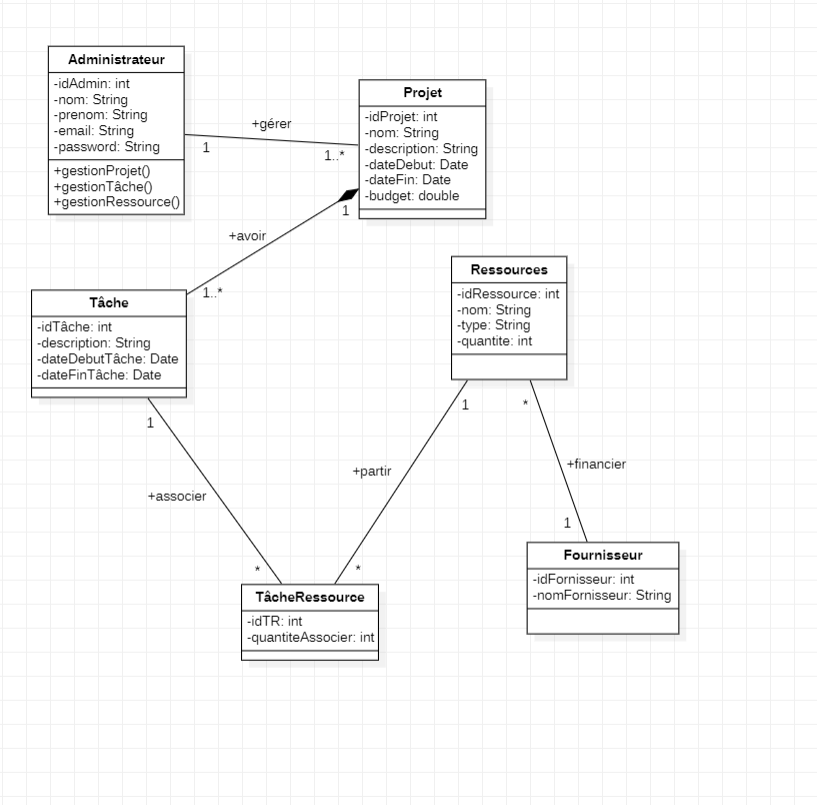
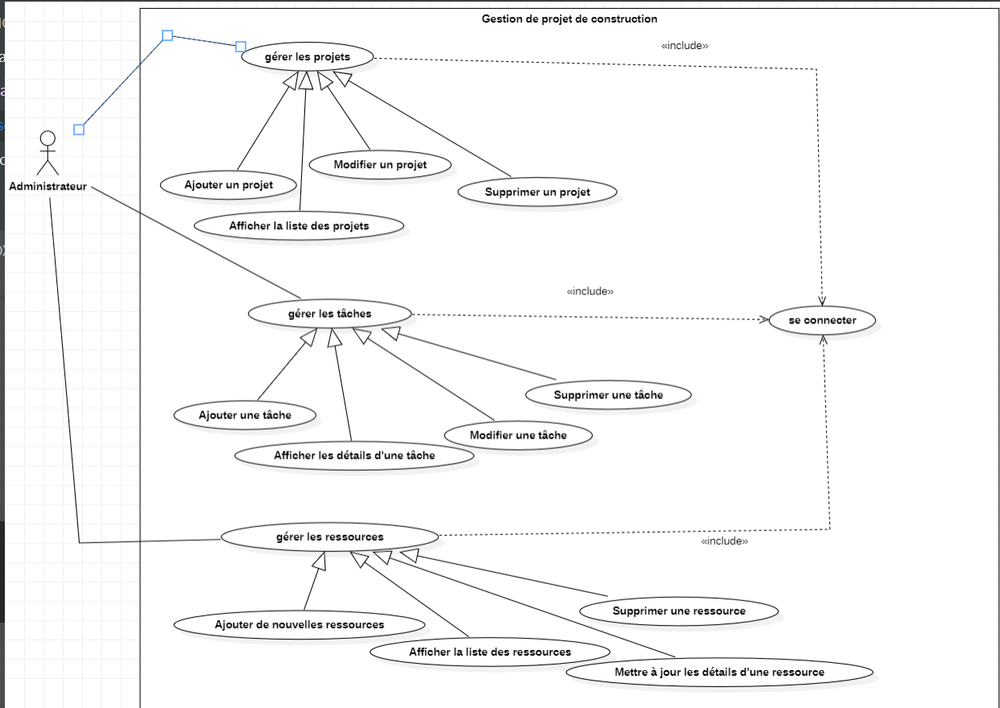
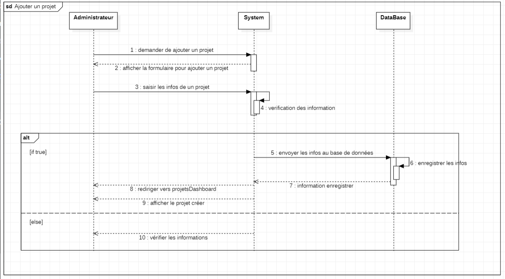

**Description**

Cette application web permet à ConstructionXpert Services de gérer efficacement ses projets en centralisant la création, l’organisation et le suivi des tâches et des ressources nécessaires à leur réalisation.

✨**Key Features**

📋 Gestion des projets : Création, modification, suppression et visualisation des projets.

✅ Gestion des tâches : Assignation de tâches aux membres de l’équipe.

🔧 Gestion des ressources : Attribution des ressources nécessaires à chaque tâche.

🔍 Suivi des projets : Visualisation des détails et de l’avancement des tâches.

🛠 **Technologies utilisées**

Backend : Java EE (Servlets, JSP, JDBC)

Base de données : MySQL 

Frontend : HTML, CSS (Tailwind), JavaScript

Serveur d'application : Apache Tomcat

